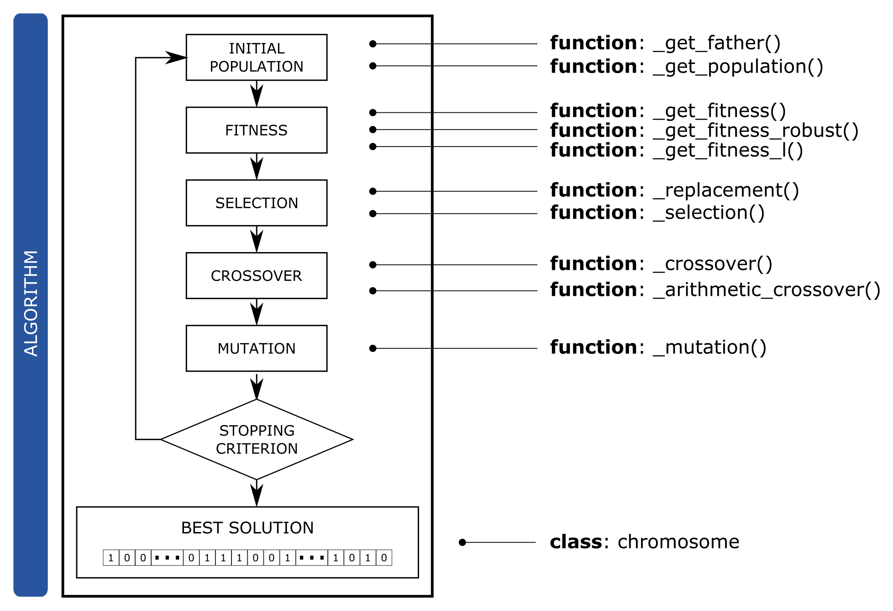
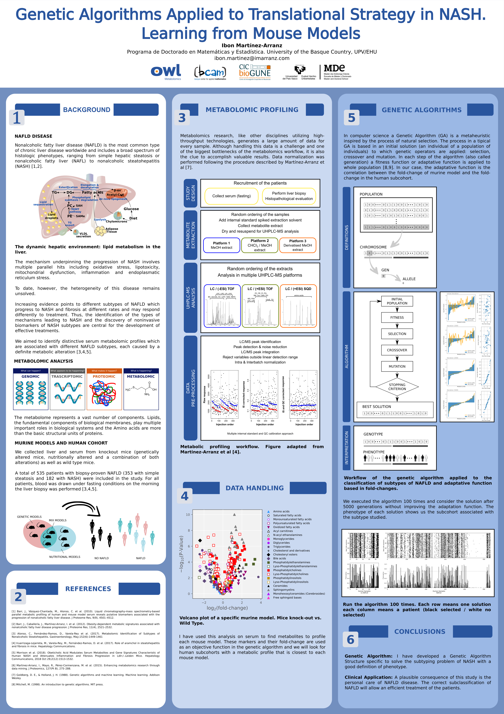

[](https://twitter.com/imarranz)
**References**  
[](https://doi.org/10.5281/zenodo.5233539)
**Version and Activity**  
<br>
<br>
<br>

**Analysis**  
<br>


                                                      


# Introduction

Nonalcoholic fatty liver disease (NAFLD) is a consequence of defects in diverse metabolic pathways or nutritional effects that involve a hepatic accumulation of triglycerides. Features of these deviations might determine whether NAFLD progresses to nonalcoholic steatohepatitis (NASH). We investigated whether the diverse defects observed in patients with NAFLD are due to different NAFLD subtypes with specific serum metabolomic profiles and whether these can distinguish patients with NASH from patients with simple steatosis.

We collected liver and serum from several murine models, which have genetic alterations, nutritional alterations or both. We also analyzed serum metabolomes of 535 patients with biopsy-proven NAFLD (353 with simple steatosis and 182 with NASH) and compared them with serum metabolomes of these murine models. In a previous analysis, we identified several subtypes of NAFLD using cluster analysis and we recognized markers that differentiate steatosis from NASH in each subtype.

In this study, a specific Genetic Algorithm (GA) has been developed to improve the identification of these subtypes in a human cohort and create a scalable methodology to identify subtypes of NAFLD. The final aim of this work is to develop a methodology for precision care in NAFLD.

Genetic Algorithms are a very useful tool to solve optimization problems but they need a good definition of a fitness function. This package has been developed in Python language and NumPy Style Python Docstrings has been used to document the package.

[example numpy style python docstrings](https://www.sphinx-doc.org/en/master/usage/extensions/example_numpy.html#example-numpy)  
[numpydoc docstring guide](https://numpydoc.readthedocs.io/en/latest/format.html)


**FIGURE**: Genetic algorithm scheme and functions associated with each step.

  * **INITIAL POPULATION/POPULATION**
    * \_get\_father(): See `tools:_get_father` function.
    * \_get\_population(): See `tools:_get_population` function.  
    
  * **FITNESS**         
    * \_get\_fitness(): See `fitness:_get_fitness` function.
    * \_get_fitness_robust(): See `fitness:_get_fitness_robust` function.
    * \_get_fitness_l(): See `fitness:_get_fitness_l` function. 
  
  * **SELECTION**     
    * \_selection(): See `operators:_selection` function.
  
  * **CROSSOVER**     
    * \_crossover(): See `operators:_crossover` function.
    * \_arithmetic\_crossover(): See `operators:_arithmetic_crossover` function.
  
  * **MUTATION**
    * \_mutation(): See `operators:_mutation` function. 


**FIGURE**: Genetic Algorithms Applied to Translational Strategy in NASH. Learning from Mouse Models. Poster presented in the II Jornadas Doctorales de la UPV/EHU 2019.
            
## CLASS `chromosome`

One of the contributions of this package is the `chromosome` class as it is specifically designed to easily solve this optimization problem. 

Import the `pygenmet` package

```python
from pygenmet import *
```

With Pyhton a `class`can be created. A `class` provides a lot of functionalities. We can create a new `clas` and then we can create a new type of object in Python. This new `class` allows new instances and these instances can also have `methods`.

The `class chromosome` has been created to optimizate the algorithm. The `docstring` associated to the `chromosome` class is the following.

```python
?chromosome
```
  
    The class chromosome has a copy of its genes, its fitness and 
    the number of No NAFLD samples and NAFLD samples for print purposes.
    
    Attributes
    ----------
    
    Methods
    -------
    
    print()  
      Prints the chromosome
    
    to_json()   
        
    Notes
    -----
    The representation of a chromosome is the following way
        
    0110101101 ... 0110101101 || 0110110011 ... 0110110011     6     6     0.89456        
    -------------------------    -------------------------   ----- -----   -------
                A                            B                 C     D        E
                    
    Description of the representation:
      A] Wild Type Genes
      B] Knock-Out Genes
      C] Number of Wild Type cases selected 
      D] Number of Knock-out cases selected
      E] The fitness value. The value of the adaptation for this chromosome
        
    Examples
    --------
    >>> CH = chromosome('01101011010110110011', 0.8945, 10, 10)
    >>> print("Genes: {}".format(CH.Genes))
    Genes: 01101011010110110011        
    >>> print("WT Genes: {}".format(CH.WT_Genes))
    WT Genes: 0110101101        
    >>> print("KO Genes: {}".format(CH.KO_Genes))
    KO Genes: 0110110011        
    >>> print("Fitness: {}".format(CH.Fitness))
    Fitness: 0.8945        
    >>> CH.print() 


```python
CH = chromosome('0110101101011000111101101011010110001111', 0.4125, 10, 30)
```


```python
print("Genes: {}".format(CH.Genes))
```

    Genes: 0110101101011000111101101011010110001111
    


```python
print("WT Genes: {}".format(CH.WT_Genes))
```

    WT Genes: 0110101101
    


```python
print("KO Genes: {}".format(CH.KO_Genes))
```

    KO Genes: 011000111101101011010110001111
    


```python
print("Fitness: {}".format(CH.Fitness))
```

    Fitness: 0.4125

### Methods

A Python method is like a Python function, except it is associated with object/classes. Methods in python are very similar to functions except for two major differences:

  * The method is **implicitly** used for an object for which it is called.
  * The method is **accessible** to data that is contained within the class.
  
The _chromosome_ class has currently two methods:

  * print()
  * to\_json()

#### print()    

The *print()* method allows to show the `chromosome` information on the screen or in a file.

The *print()* method has an argument, _N_, and with this argument we can customized the number of alleles to print. This method print first de _Wild Types_ genes and second the _KO_ genes separated by ||. The number of alleles equal to 1 for each gen is also printed. At last, the fitness function value is shown.

```python
CH.print(N = 3) 
```

    011 ... 101 || 011 ... 111 	   6	  18	         0.4125

    
```python
CH.print(N = 5) 
```

    01101 ... 01101 || 01100 ... 01111 	   6	  18	         0.4125    

#### to\_json()

**json** or **JavaScript Object Notation** is an open standard file format, that uses human-readable text to store and transmit data objects consisting of attribute–value pairs and array data types. It is a very common data format, with a diverse range of applications.

```python
CH.to_json(path_or_buf = 'out.json')
```

file `out.json` has de following structure:

```json
{"chromosome": [{"Genes": "0110101101011000111101101011010110001111", 
                 "Fitness": 0.4125, 
                 "WT_Genes": "0110101101", 
                 "KO_Genes": "011000111101101011010110001111"}]}
```
    
## fitness

Import the `pygenmet` package


```python
from pygenmet import *
```

Currently, three fully customizable fitness functions are developed in `pygenmet` package:

  * \_get\_fitness
  * \_get\_fitness\_robust
  * \_get\_fitness\_l
  

### fitness.\_get_fitness

The `docstring` associated to the `_get_fitness` function is the following.

```python
?_get_fitness
```

    Parameters
    ----------
    genes : Genes of a chromosome
    nwt : Number of observations of Wild Type
    nko : Number of observations of Knock-out
    dwt : Data of observations of Wild Type
    dko : Data of observations of Knock-out
    obj : Array of fold-changes of metabolites in murine model
    l : float Usually 0.5 / length(fc1). If length(fc1) = 50 then l = 0.01
    
    Returns
    -------
    p : float
        The aptitude of a genes of a chromosome (solution) is the correlation between fc1 and fc2. 
        Initially the aptitude (fitness) of a chromosome is the Pearson Correlation between the 
        fold-change of Knock-out select samples and Wild Type selected samples with the fold-change of
        the murine model analyzed (a vector of ¿50? fold-changes).
    
    Notes
    -----
    This function evaluates the Pearson Correlation 
    between fc1 and fc2 with a penalty for different sign 
    in the values. This function uses pearsonr from scipy and
    sign from numpy to evaluate the aptitude.
    
    The penalty has been named l.
    
    Examples
    --------

### fitness.\_get\_fitness\_robust

The `docstring` associated to the `_get_fitness_robust` function is the following.

```python
?_get_fitness_robust
```

    Parameters
    ----------
    genes : Genes of a chromosome
    nwt : Number of observations of Wild Type
    nko : Number of observations of Knock-out
    dwt : Data of observations of Wild Type
    dko : Data of observations of Knock-out
    obj : Array of fold-changes of metabolites in murine model
    l : float Usually 0.5 / length(fc1). If length(fc1) = 50 then l = 0.01
    
    Returns
    -------
    p : float
        The aptitude of a genes of a chromosome (solution) is the correlation between fc1 and fc2. 
        Initially the aptitude (fitness) of a chromosome is the Pearson Correlation between the 
        fold-change of Knock-out select samples and Wild Type selected samples with the fold-change of
        the murine model analyzed (a vector of ¿50? fold-changes).
    
    Notes
    -----
    This function evaluates the Pearson Correlation 
    between fc1 and fc2 with a penalty for different sign 
    in the values. This function uses pearsonr from scipy and
    sign from numpy to evaluate the aptitude.
    
    The penalty has been named l.
    
    Examples
    --------

###  fitness.\_get\_fitness\_l

The `docstring` associated to the `_get_fitness_l` function is the following.

```python
?_get_fitness_l
```
    Parameters
    ----------
    genes : Genes of a chromosome
    nwt : Number of observations of Wild Type
    nko : Number of observations of Knock-out
    dwt : Data of observations of Wild Type
    dko : Data of observations of Knock-out
    obj : Array of fold-changes of metabolites in murine model
    
    Returns
    -------
    p : float
        The aptitude of a genes of a chromosome (solution) is the correlation between fc1 and fc2. 
        Initially the aptitude (fitness) of a chromosome is the Pearson Correlation between the 
        fold-change of Knock-out select samples and Wild Type selected samples with the fold-change of
        the murine model analyzed (a vector of ¿50? fold-changes).
    
    Notes
    -----
    This function evaluates the Pearson Correlation 
    between fc1 and fc2 with a penalty for different sign 
    in the values. This function uses pearsonr from scipy and
    sign from numpy to evaluate the aptitude.
    
    The penalty has been named l.
    
    Examples
    --------

## operators

Import the `pygenmet` package


```python
from ..tools.tools import chromosome
```


```python
import pandas as pd
import numpy as np
```

### Crossover

#### operators.\_crossover

The `docstring` associated to the `_crossover` function is the following.

```python
?_crossover
```

    Parameters
    ----------
    chromosome_a: Chromosome
    chromosome_b: Chromosome
    k: k-point. If k = 1 the method will be single-point crossover, 
                If k = 2 the method will be two-point crossover. 
                If k = N (with N the length of chromosome) the method will be the uniform crossover. Its value is 1 by default.
    
    Returns
    -------
    Two new chromosomes
    
    Notes
    -----
    [1]
    
    References
    ----------
    [1] https://en.wikipedia.org/wiki/Crossover_(genetic_algorithm)
    
    Examples
    --------
    >>> A = _get_father(nwt = dwt.shape[0], nko = dko.shape[0], 
                        dwt = dwt, dko = dko,
                        geneSet = '01', 
                        get_fitness = _get_fitness, obj = np.array(FC.loc[:, murine_models_in[4]]))

    >>> B = _get_father(nwt = dwt.shape[0], nko = dko.shape[0], 
                        dwt = dwt, dko = dko,
                        geneSet = '01', 
                        get_fitness = _get_fitness, obj = np.array(FC.loc[:, murine_models_in[4]]))

    >>> A.print()
    011000111111010 ... 001000010001110 || 001010011000110 ... 011001001111111 	  43	 336	0.03363686825576087

    >>> B.print()
    100101111101111 ... 010001000100101 || 010101001001010 ... 111010000101010 	  42	 345	0.1410663212679354

    >>> A1, B1 = _crossover(A, B, get_fitness = _get_fitness,  
                        nwt = dwt.shape[0], nko = dko.shape[0], dwt = dwt, dko = dko, 
                        obj = np.array(FC.loc[:, murine_models_in[4]]), k = 1)

    >>> A1.print()
    011000111111010 ... 001000010001110 || 001010011000110 ... 111010000101010 	  43	 327	0.007288743389698732

    >>> B1.print()
    100101111101111 ... 010001000100101 || 010101001001010 ... 011001001111111 	  42	 354	0.15370276754212897

    >>> A1, B1 = _crossover(A, B, get_fitness = _get_fitness,  
                        nwt = dwt.shape[0], nko = dko.shape[0], dwt = dwt, dko = dko, 
                        obj = np.array(FC.loc[:, murine_models_in[4]]), k = 772)

    >>> A1.print()
    110000111101111 ... 000000010001111 || 011111001001110 ... 011000001111111 	  43	 355	0.017131591198246282

    >>> B1.print()
    001101111111010 ... 011001000100100 || 000000011000010 ... 111011000101010 	  42	 326	0.13633106854522628
    
#### operators.\_arithmetic\_crossover

```python
?_arithmetic_crossover
```

    Notes
    -----
    For this specific genotype (GeneSet = '01') the arithmetic crossover techniques are available.
    These techniques are:
      [1] AND
      [2] OR
      [3] XOR
    Arithmetic crossover - some arithmetic operation is performed to make a new offspring [1]
    
    References
    ----------
    [1] https://www.obitko.com/tutorials/genetic-algorithms/crossover-mutation.php
    

### Mutation

#### operators.\_mutation

```python
?_mutation
```

    Parameters
    ----------
    father : Genes of the father
    geneSet : Set of genes availables. Usually '0' and '1'
    get_fitness : Function to improve
    nwt : Number of No NAFLD Samples
    nko : Number of NAFLD Samples
    dwt : Data of No NAFLD Samples
    dko : Data of NAFLD Samples
    obj : The fold-changes of murine model to adjust
    type : Type of mutation process, 'bsm' by default. Five types are allowed.
           bf : bitflip
           bsm : bitstringmutation
           sw : swap
           in : inversion
           sc : scramble
    p : Parameter to modify the posibility of change in a genes
    
    Returns
    -------
    A new mutated chromosome by the type of mutation process
    
    Notes
    -----
    The flipbit (fb) mutation is an aggressive mutation because change all genes. 
    If in a specific gen the alelo value is '0' this process will change it to '1'.
    
    fb: '0101010101' -> '1010101010'
    
    The bitstringmutation (bsm) mutation process will change a gen with a 
    probability 'p'. If p = None then p = 1/len(genes) [1].
    
    bsm: '0101010101' -> '0101110101'
    
    References
    ----------
    
    [1] https://en.wikipedia.org/wiki/Mutation_(genetic_algorithm)
    [2] https://www.tutorialspoint.com/genetic_algorithms/genetic_algorithms_mutation.htm
    
    Examples
    --------
    

### Selection

#### operators.\_replacement

```python
?_replacement
```

    Parameters
    ----------
    type : Type of replacement
           rws : Replace Worst Strategy
           rts : Restricted Tournament Selection
           wams : Worst Among Most Similar Replacement
    
    
    Notes
    -----    
    The _replacement function is ised to change the old generation population with the new generation. 
    Four process have been evaluated [1]:
    
     1) Replace Worst Strategy (RW). The worst element of the population is replaced if the child improves it.
     It offers high selective pressure, even when its parents are chosen randomly.
    
     2) Restricted Tournament Selection (RTS) [2].
    
     3) Replace the Worst Among Most Similar Replacement (WAMS) [3]. the worst chromosome of the
     set of the N (N = 3,...) parents most similar to the offspring.
    
     4) Deterministic Crowding Algorithm (Deterministic Crowding, DC) [4]. To facilitate the comparison we will use in our experiments. A variant of the DC in which a single descendant will be generated for each cross, which will replace the most similar parent if it improves it. 
    
    References
    ----------
    [1] https://sci2s.ugr.es/keel/pdf/keel/congreso/4-diversidadfinal2_daniel_molina.pdf
    [2] G.   Harik.   Finding   multimodal   solutions   using restricted  tournament  selection. Proc.  6th  Int.  Conf. Genetic Algorithms, páginas 24-31, 1995.
    [3] W. Cedeño and V. Vemuri. Multi-niche crowding in genetic algorithms and its application to the assembly of dna restriction-fragments. Evolutionary Computation, 2(4):321-345, 1995.    
    [4] S.W. Mahfoud. Crowding and preselection revised. Parallel Problem Solving from Nature 2, páginas 27-36, 1992.
    
#### operators.\_selection

```python
?_selection
```

    HAY DOS TIPOS DE SELECCIÓN. LA QUE SELECCIONA FUTUROS PADRES Y LOS SELECCIONA PADRES PARA CRUZARLOS
    
    Tecnicas de emparejamiento:
    Los padres se pueden seleccionar de forma que se mantenga la diversidad de la poblacion 
    
    1) Prohibicion de cruce basada en ascendencia. Un individuo no puede emparejarse con el mismo, ni con sus padres, ni con sus hijos, ni con sus hermanos
    
    2) Prohibicion de incesto. Dos padres se cruzan si su distancia Hamming esta por encima de cierto umbral
    
    3) Emparejamiento variado. Un individuo se cruza con otro que es bastante diferente. Distancia de Hamming
    
    LA QUE SELECCIONA UNA NUEVA GENERACIÓN
    
    1) Random Selection (RS)
    
    2) Tournament Selection (TS): escoge al individuo de mejor
    fitness de entre N individuos seleccionados aleatoriamente (N = 2, 3, . . . )
    La seleccion por torneo, constituye un procedimiento de seleccion de padres muy extendido y en el cual 
    la idea consiste en escoger al azar un numero de individuos de la poblacion, taman~o del torneo, 
    (con o sin reemplazamiento), seleccionar el mejor individuo de este grupo, y repetir el proceso hasta que 
    el numero de individuos seleccionados coincida con el taman~o de la poblacion. Habitualmente el 
    taman~o del torneo es 2, y en tal caso se ha utilizado una version probabilistica en la cual se permite 
    la seleccion de individuos sin que necesariamente sean los mejores.

    3) Linear Rank Selection (LRS): la poblacion se ordena en funcion de su fitness 
    y se asocia una probabilidad de seleccion a cada individuo que depende de su orden
    
    4) Seleccion por Ruleta (Roulette Selection, RS): asigna una probabilidad de seleccion proporcional al valor del fitness del individuo
    Baker (1987) introduce un metodo denominado muestreo universal estocastico, el cual utiliza un unico giro 
    de la ruleta siendo los sectores circulares proporcionales a la funcion objetivo. Los individuos son 
    seleccionados a partir de marcadores, igualmente espaciados y con comienzo aleatorio. (algoritmos geneticos.pdf)
    
    5) Elitista: En el modelo de seleccion elitista se fuerza a que el mejor individuo de la poblacion 
    en el tiempo t, sea seleccionado como padre.
    
    Parameters
    ----------
    chromosomes : List of chromosomes of the population
    size : Number of individuals to select from the population. This parameter is not considered with method = 'elitist'.
    N : Number of Genes to print (if trace is True)
    trace : Should be the chromosomes and the selection printed on the screen
    method: The method used for selection: ['random', 'tournament', 'linear', 'roulette', 'elitist']
    
    Returns
    -------
    fitness : The fitness of each chromosome (individual)
    psel : Probabilities of selecction of each chromosome. pesl(x) = f(x) / sum(f(y)), for each x in y
    selecction : List of selected chromosomes
    
    Notes
    -----
    The aim of this function is to evaluate the fitness of each population (by the chromosome structure) and 
    to asign a probability to select for a new population (next generation).
    
    Examples
    --------
    >>> A_ = []
    >>> A_.append(chromosome(genes = '01010001010110100100', nwt = 10, nko = 10, fitness = 2.3454))
    >>> A_.append(chromosome(genes = '01011011110110100100', nwt = 10, nko = 10, fitness = 1.4401))
    >>> A_.append(chromosome(genes = '01010001010100000100', nwt = 10, nko = 10, fitness = 0.9254))
    >>> A_.append(chromosome(genes = '01110101010110100100', nwt = 10, nko = 10, fitness = 7.1104))
    >>> A_.append(chromosome(genes = '01010101110111100100', nwt = 10, nko = 10, fitness = 2.1494))
    >>> A_.append(chromosome(genes = '01010001110000100100', nwt = 10, nko = 10, fitness = 1.9954))
    >>> A_.append(chromosome(genes = '00000000010110100100', nwt = 10, nko = 10, fitness = 1.7323))
    >>> A_.append(chromosome(genes = '01010000111110100111', nwt = 10, nko = 10, fitness = 1.5002))
    >>> A_.append(chromosome(genes = '01110011010110100111', nwt = 10, nko = 10, fitness = 2.4119))
    >>> A_.append(chromosome(genes = '01010011011110101100', nwt = 10, nko = 10, fitness = 2.1414))

    >>> selection, fit, ps, sel_mean, sel_maximun = _selection(A_, size = 4, N = 8, trace = True, method = 'roulette')

    |---------------------------------------------------------------------------------------------|
    |-------------- fenotypes ---------------||--- genotypes ---||--- fitness ---||- Probability -|
    01010001...01000101 || 01101001...10100100         4        4           2.3454       0.09912204
    01011011...01101111 || 01101001...10100100         7        4           1.4401       0.07244166
    01010001...01000101 || 01000001...00000100         4        2           0.9254       0.05727278
    01110101...11010101 || 01101001...10100100         6        4           7.1104       0.23955286
    01010101...01010111 || 01111001...11100100         6        5           2.1494       0.09334567
    01010001...01000111 || 00001001...00100100         5        2           1.9954       0.08880708
    00000000...00000001 || 01101001...10100100         1        4           1.7323       0.08105318
    01010000...01000011 || 11101001...10100111         4        7           1.5002       0.07421289
    01110011...11001101 || 01101001...10100111         6        6           2.4119       0.10108189
    01010011...01001101 || 11101011...10101100         5        6           2.1414       0.09310990
    |---------------------------------------------------------------------------------------------|
    |-------------- fenotypes ---------------||--- genotypes ---||--- fitness ---||- Probability -|
    01110101...11010101 || 01101001...10100100         6        4           7.1104       0.23955286
    01010001...01000101 || 01101001...10100100         4        4           2.3454       0.09912204
    01010001...01000111 || 00001001...00100100         5        2           1.9954       0.08880708
    01010011...01001101 || 11101011...10101100         5        6           2.1414       0.09310990

    >>> selection, fit, ps, sel_mean, sel_maximun = _selection(A_, size = 4, N = 8, trace = True, method = 'linear')

    |---------------------------------------------------------------------------------------------|
    |-------------- fenotypes ---------------||--- genotypes ---||--- fitness ---||- Probability -|
    01010001...01000101 || 01101001...10100100         4        4           2.3454       0.15555555
    01011011...01101111 || 01101001...10100100         7        4           1.4401       0.02222222
    01010001...01000101 || 01000001...00000100         4        2           0.9254              0.0
    01110101...11010101 || 01101001...10100100         6        4           7.1104              0.2
    01010101...01010111 || 01111001...11100100         6        5           2.1494       0.13333333
    01010001...01000111 || 00001001...00100100         5        2           1.9954       0.08888888
    00000000...00000001 || 01101001...10100100         1        4           1.7323       0.06666666
    01010000...01000011 || 11101001...10100111         4        7           1.5002       0.04444444
    01110011...11001101 || 01101001...10100111         6        6           2.4119       0.17777777
    01010011...01001101 || 11101011...10101100         5        6           2.1414       0.11111111
    |---------------------------------------------------------------------------------------------|
    |-------------- fenotypes ---------------||--- genotypes ---||--- fitness ---||- Probability -|
    01011011...01101111 || 01101001...10100100         7        4           1.4401       0.02222222
    01010000...01000011 || 11101001...10100111         4        7           1.5002       0.04444444
    01110101...11010101 || 01101001...10100100         6        4           7.1104              0.2
    01010001...01000101 || 01101001...10100100         4        4           2.3454       0.15555555

    >>> selection, fit, ps, sel_mean, sel_maximun = _selection(A_, size = 4, N = 8, trace = True, method = 'random')

    |---------------------------------------------------------------------------------------------|
    |-------------- fenotypes ---------------||--- genotypes ---||--- fitness ---||- Probability -|
    01010001...01000101 || 01101001...10100100         4        4           2.3454              0.1
    01011011...01101111 || 01101001...10100100         7        4           1.4401              0.1
    01010001...01000101 || 01000001...00000100         4        2           0.9254              0.1
    01110101...11010101 || 01101001...10100100         6        4           7.1104              0.1
    01010101...01010111 || 01111001...11100100         6        5           2.1494              0.1
    01010001...01000111 || 00001001...00100100         5        2           1.9954              0.1
    00000000...00000001 || 01101001...10100100         1        4           1.7323              0.1
    01010000...01000011 || 11101001...10100111         4        7           1.5002              0.1
    01110011...11001101 || 01101001...10100111         6        6           2.4119              0.1
    01010011...01001101 || 11101011...10101100         5        6           2.1414              0.1
    |---------------------------------------------------------------------------------------------|
    |-------------- fenotypes ---------------||--- genotypes ---||--- fitness ---||- Probability -|
    01010101...01010111 || 01111001...11100100         6        5           2.1494              0.1
    01010001...01000101 || 01000001...00000100         4        2           0.9254              0.1
    01010011...01001101 || 11101011...10101100         5        6           2.1414              0.1
    01010001...01000101 || 01101001...10100100         4        4           2.3454              0.1
    
    >>> selection, fit, ps, sel_mean, sel_maximun = _selection(A_, size = 4, N = 8, trace = True, method = 'elitist')

    |---------------------------------------------------------------------------------------------|
    |-------------- fenotypes ---------------||--- genotypes ---||--- fitness ---||- Probability -|
    01010001...01000101 || 01101001...10100100         4        4           2.3454       ----------
    01011011...01101111 || 01101001...10100100         7        4           1.4401       ----------
    01010001...01000101 || 01000001...00000100         4        2           0.9254       ----------
    01110101...11010101 || 01101001...10100100         6        4           7.1104       ----------
    01010101...01010111 || 01111001...11100100         6        5           2.1494       ----------
    01010001...01000111 || 00001001...00100100         5        2           1.9954       ----------
    00000000...00000001 || 01101001...10100100         1        4           1.7323       ----------
    01010000...01000011 || 11101001...10100111         4        7           1.5002       ----------
    01110011...11001101 || 01101001...10100111         6        6           2.4119       ----------
    01010011...01001101 || 11101011...10101100         5        6           2.1414       ----------
    |---------------------------------------------------------------------------------------------|
    |-------------- fenotypes ---------------||--- genotypes ---||--- fitness ---||- Probability -|
    01010101...01010111 || 01111001...11100100         6        5           2.1494       ----------
    01010001...01000101 || 01101001...10100100         4        4           2.3454       ----------
    01110011...11001101 || 01101001...10100111         6        6           2.4119       ----------
    01110101...11010101 || 01101001...10100100         6        4           7.1104       ----------
    
    >>> selection, fit, ps, sel_mean, sel_maximun = _selection(A_, size = 4, N = 8, trace = True, method = 'tournament')

    |---------------------------------------------------------------------------------------------|
    |-------------- fenotypes ---------------||--- genotypes ---||--- fitness ---||- Probability -|
    01010001...01000101 || 01101001...10100100         4        4           2.3454       ----------
    01011011...01101111 || 01101001...10100100         7        4           1.4401       ----------
    01010001...01000101 || 01000001...00000100         4        2           0.9254       ----------
    01110101...11010101 || 01101001...10100100         6        4           7.1104       ----------
    01010101...01010111 || 01111001...11100100         6        5           2.1494       ----------
    01010001...01000111 || 00001001...00100100         5        2           1.9954       ----------
    00000000...00000001 || 01101001...10100100         1        4           1.7323       ----------
    01010000...01000011 || 11101001...10100111         4        7           1.5002       ----------
    01110011...11001101 || 01101001...10100111         6        6           2.4119       ----------
    01010011...01001101 || 11101011...10101100         5        6           2.1414       ----------
    |---------------------------------------------------------------------------------------------|
    |-------------- fenotypes ---------------||--- genotypes ---||--- fitness ---||- Probability -|
    00000000...00000001 || 01101001...10100100         1        4           1.7323       ----------
    01010000...01000011 || 11101001...10100111         4        7           1.5002       ----------
    01110011...11001101 || 01101001...10100111         6        6           2.4119       ----------
    01010101...01010111 || 01111001...11100100         6        5           2.1494       ----------
    01110101...11010101 || 01101001...10100100         6        4           7.1104       ----------

## tools

Import the `pygenmet` package

```python
from pygenmet import *
```


```python
import pandas as pd
import numpy as np
```

### tools.\_get\_father

With the function `\_get\_father()` we can to generate an initial solution. We can to initializate `nwt`, `dwt`, `nko` and `dko`. For replicate purpose, this function has the _random\_state_ argument.

The `docstring` associated to the `_get_father` function is the following.

```python
?_get_father
```

    Parameters
    ----------
    nwt : Number of observations of Wild Type
    nko : Number of observations of Knock-out
    dwt : Data of observations of Wild Type
    dko : Data of observations of Knock-out
    geneSet: Usually a list as '01'
    get_fitness: The fitness function to use
    obj : Array of fold-changes of metabolites in murine model
    random_state: If you don't mention the random_state in the code, then whenever you execute your code a new random value
    
    Returns
    -------
    This function returns a chromosome
    
    Examples
    --------    
    >>> _get_father(nwt = nwt, nko = nko, dwt = dwt, dko = dko, geneSet = '01', get_fitness = _get_fitness, obj = FC.FC).print()
    011101101010000 ... 000000001000001 || 101110011001010 ... 011110110000011    37     261    -0.04568152517704738
    
    >>> _get_father(nwt = nwt, nko = nko, dwt = dwt, dko = dko, geneSet = '01', get_fitness = _get_fitness, obj = FC.FC).print()
    000101011001011 ... 101100010101101 || 010000101000100 ... 110111010001010    46     252    -0.07192848665245967
    
    >>> _get_father(nwt = nwt, nko = nko, dwt = dwt, dko = dko, geneSet = '01', get_fitness = _get_fitness, obj = FC.FC).print()
    110101100111011 ... 000110110110111 || 110010000110100 ... 110010011101011    49     267    -0.11718322152992591


```python
nwt = 15
nko = 25
dwt = pd.DataFrame(np.random.rand(nwt,10))
dko = pd.DataFrame(np.random.rand(nko,10))

for i in np.arange(10):
    A = _get_father(nwt = nwt, nko = nko, dwt = dwt, dko = dko, 
                    geneSet = '01', get_fitness = _get_fitness, 
                    obj = [1,0,1,-1,1,0,0,1,0.5, 0.5])

    A.print()
```

    000100010101011 ... 000100010101011 || 010011110000011 ... 000110111000101 	   6	  12	-0.01750455939922404
    010100000111001 ... 010100000111001 || 000111111010001 ... 100010010110110 	   6	  13	0.01583165234542458
    001010100111101 ... 001010100111101 || 101110011011111 ... 111110100001101 	   8	  15	0.1337101625593648
    011011101001110 ... 011011101001110 || 011111111111101 ... 111010000110111 	   9	  18	0.3326538149497444
    101100111001001 ... 101100111001001 || 010100110110000 ... 100001010110001 	   8	  11	0.09708129202192302
    010001010010001 ... 010001010010001 || 100111000100111 ... 001110100100100 	   5	  11	0.1442876222067664
    000000000011101 ... 000000000011101 || 100100011111100 ... 111000011110101 	   4	  14	0.28826914052937097
    110100111110100 ... 110100111110100 || 111011001010111 ... 101111010101001 	   9	  15	-0.377007167796123
    100111000110010 ... 100111000110010 || 111001110110000 ... 100001101111100 	   7	  15	0.3216335311818925
    000111101101000 ... 000111101101000 || 100010011101100 ... 011001100001110 	   7	  12	-0.09813075927314555
    


```python
for i in np.arange(10):
    A = _get_father(nwt = nwt, nko = nko, dwt = dwt, dko = dko, 
                    geneSet = '01', get_fitness = _get_fitness, 
                    obj = [1,0,1,-1,1,0,0,1,0.5, 0.5], 
                    random_state = 42)

    A.print()
```

    100011100001001 ... 100011100001001 || 101101100100011 ... 000111111011111 	   6	  17	0.04061614908467767
    100011100001001 ... 100011100001001 || 101101100100011 ... 000111111011111 	   6	  17	0.04061614908467767
    100011100001001 ... 100011100001001 || 101101100100011 ... 000111111011111 	   6	  17	0.04061614908467767
    100011100001001 ... 100011100001001 || 101101100100011 ... 000111111011111 	   6	  17	0.04061614908467767
    100011100001001 ... 100011100001001 || 101101100100011 ... 000111111011111 	   6	  17	0.04061614908467767
    100011100001001 ... 100011100001001 || 101101100100011 ... 000111111011111 	   6	  17	0.04061614908467767
    100011100001001 ... 100011100001001 || 101101100100011 ... 000111111011111 	   6	  17	0.04061614908467767
    100011100001001 ... 100011100001001 || 101101100100011 ... 000111111011111 	   6	  17	0.04061614908467767
    100011100001001 ... 100011100001001 || 101101100100011 ... 000111111011111 	   6	  17	0.04061614908467767
    100011100001001 ... 100011100001001 || 101101100100011 ... 000111111011111 	   6	  17	0.04061614908467767
    

### tools.\_get\_population

The `docstring` associated to the `_get_population` function is the following.

```python
?_get_population
```

    Parameters
    ----------
    individuals : Number of individual of first generation or initial population
    nwt : Number of observations of Wild Type
    nko : Number of observations of Knock-out
    dwt : Data of observations of Wild Type
    dko : Data of observations of Knock-out
    geneSet : Usually a list as '01'
    get_fitness : The fitness function to use
    obj : Array of fold-changes of metabolites in murine model
    random_state : If you don't mention the random_state in the code, then whenever you execute your code a new random value
    
    Returns
    -------
    population_ : A list of the initial population (chromosomes) to initialize the algorithm
    
    Notes
    -----
    
    Examples
    --------
    >>> nwt = 15
    >>> nko = 25
    >>> dwt = pd.DataFrame(np.random.rand(nwt,10))
    >>> dko = pd.DataFrame(np.random.rand(nko,10))
    >>> A = _get_population(individuals = 10, 
                            nwt = nwt, nko = nko, dwt = dwt, dko = dko, 
                            geneSet = '01', get_fitness = _get_fitness, obj = [1,0,1,-1,1,0,0,1,0.5, 0.5])
    
    >>> [A_.print() for A_ in A];
    110101101011111 ... 110101101011111 || 101110000011110 ... 111101111110101    11      16    0.27010320047631353
    110001101000111 ... 110001101000111 || 111011001000100 ... 001001100010011     8      12    0.4153593539526977
    110110110000111 ... 110110110000111 || 111001000001001 ... 010011110110101     9      13    0.24120026823063395
    001001101100010 ... 001001101100010 || 101000001100111 ... 001110111010010     6      12    0.5976992970173265
    110110101000111 ... 110110101000111 || 100011000000110 ... 001100011111011     9      12    0.4327563879291974
    010110111011011 ... 010110111011011 || 101101110101111 ... 011110010010000    10      13    0.19109063637942147
    011011111001110 ... 011011111001110 || 000001110011000 ... 110001111010111    10      13    0.19291545113399683
    100010011100001 ... 100010011100001 || 011101010010100 ... 101001111100011     6      14    0.3838922708272582
    110001111111010 ... 110001111111010 || 110111010001010 ... 010100000000100    10       9    0.04833875255418793
    001111011101100 ... 001111011101100 || 100011000100101 ... 001010101000110     9      10    0.6180057110908423    


```python
nwt = 15
nko = 25
dwt = pd.DataFrame(np.random.rand(nwt,10))
dko = pd.DataFrame(np.random.rand(nko,10))
A = _get_population(individuals = 10, 
                    nwt = nwt, nko = nko, dwt = dwt, dko = dko, 
                    geneSet = '01', get_fitness = _get_fitness, 
                    obj = [1,0,1,-1,1,0,0,1,0.5, 0.5])

[A_.print() for A_ in A];
```

    001100101100011 ... 001100101100011 || 010111011100111 ... 001111010101001 	   7	  15	0.22717953288324988
    011111001110011 ... 011111001110011 || 110011011010001 ... 100011100110100 	  10	  13	-0.14158703160537597
    000111000110010 ... 000111000110010 || 000111011011101 ... 111010101101111 	   6	  16	-0.14752436179984593
    111110011001001 ... 111110011001001 || 111101011001011 ... 010111111010101 	   9	  17	0.37230832910925965
    111100011100110 ... 111100011100110 || 001000100111010 ... 110100000100011 	   9	   9	0.09942842284405343
    011100001011101 ... 011100001011101 || 001010010010100 ... 101000010010000 	   8	   7	-0.29440398210415947
    111011011011101 ... 111011011011101 || 000101001001101 ... 011011010111110 	  11	  13	0.262667504755609
    000000010010100 ... 000000010010100 || 111110001111110 ... 111101010010111 	   3	  17	-0.3603100204852186
    111110110010001 ... 111110110010001 || 100101000011100 ... 111000110100010 	   9	  10	-0.254079327688995
    001010010000000 ... 001010010000000 || 100111101001111 ... 011111000011110 	   3	  15	0.3651577081778396

### tools.\_read\_chromosome

This function read the chromosome information from a file and it is loaded in memory. The file can be generated by `to_json()` method.

The `docstring` associated to the `_read_chromosome` function is the following.

```python
?_read_chromosome
```

    Parameters
    ----------
    path_or_buf :  string or file handle. File path or object.
    
    Returns
    -------
    This function returns a chromosome
    
    Examples
    --------
    >>> A = chromosome(genes = '00100101001001011000111010110010', nko=16, nwt=16, fitness=0.98)
    >>> A.print(5)
    00100 ... 00101 || 10001 ... 10010     6       8               0.98
    >>> A.to_json('prueba.json')
    >>> B = _read_chromosome('prueba.json')
    >>> B.print(10)
    0010010100 ... 0100100101 || 1000111010 ... 1010110010         6       8               0.98    


```python
new_CH = _read_chromosome(path_or_buf = 'out.json')
new_CH.print()
```

    0110101101 ... 0110101101 || 011000111101101 ... 011010110001111 	   6	  18	         0.4125

    # Examples

Import the `pygenmet` package


```python
from pygenmet import *
```


```python
import pandas as pd
import numpy as np
import random
import datetime
```

We define a new fitness function.

### Definition of a simple fitness function

We define a simple fitness function. This function always returns the 1.0 value.


```python
def my_own_get_fitness(genes, nwt, nko, dwt, dko, obj):

    p = 1.0
   
    return p
```

Now, we generate 10 initial solutions (by `_get_father_`function) and we can see the fitness function for each solution.


```python
nwt = 15
nko = 25
dwt = pd.DataFrame(np.array(random.choices('01', k = nwt * 10)).reshape(nwt, 10))
dko = pd.DataFrame(np.array(random.choices('01', k = nko * 10)).reshape(nko, 10))

for i in np.arange(10):
    A = _get_father(nwt = nwt, nko = nko, dwt = dwt, dko = dko, 
                    geneSet = '01', get_fitness = my_own_get_fitness, 
                    obj = 1)

    A.print()
```

    110011000001000 ... 110011000001000 || 110011001111101 ... 111011110111010 	   5	  17	            1.0
    111110000101011 ... 111110000101011 || 100110000001111 ... 011110100001011 	   9	  11	            1.0
    010001110001001 ... 010001110001001 || 101010000001001 ... 010011011011110 	   6	  12	            1.0
    100110001011100 ... 100110001011100 || 011111100111111 ... 111111101001100 	   7	  17	            1.0
    111101110100010 ... 111101110100010 || 001000001001111 ... 011111011000001 	   9	  10	            1.0
    001110011101011 ... 001110011101011 || 001110001101100 ... 011001000001110 	   9	  11	            1.0
    100110010100001 ... 100110010100001 || 101011001110011 ... 100111110100001 	   6	  14	            1.0
    101000101010110 ... 101000101010110 || 011110001000010 ... 000101001101101 	   7	  12	            1.0
    101101000111111 ... 101101000111111 || 010001011010110 ... 101100011110110 	  10	  13	            1.0
    100010011101000 ... 100010011101000 || 100000001100100 ... 001000101000100 	   6	   7	            1.0
    

### Definition of a little more complex function

In this case, we considerer the following fitness function.

```python
def my_own_get_fitness(genes, nwt, nko, dwt, dko, obj):
    
    N_WT = sum(1 for x in genes[:nwt] if x == '1')
    N_KO = sum(1 for x in genes[nwt:] if x == '1')

    p = N_WT / N_KO
    
    return p
```


```python
nwt = 15
nko = 25
dwt = pd.DataFrame(np.array(random.choices('01', k = nwt * 10)).reshape(nwt, 10))
dko = pd.DataFrame(np.array(random.choices('01', k = nko * 10)).reshape(nko, 10))

for i in np.arange(10):
    A = _get_father(nwt = nwt, nko = nko, dwt = dwt, dko = dko, 
                    geneSet = '01', get_fitness = my_own_get_fitness, 
                    obj = 1)

    A.print()
```

    101101010001100 ... 101101010001100 || 001111100111000 ... 110001000000010 	   7	  10	            0.7
    011111101110001 ... 011111101110001 || 101011110010001 ... 100010110010100 	  10	  12	0.8333333333333334
    100010101100111 ... 100010101100111 || 101011111110000 ... 100000101111010 	   8	  15	0.5333333333333333
    111111010110110 ... 111111010110110 || 100010110011100 ... 111001100100110 	  11	  12	0.9166666666666666
    110001100110000 ... 110001100110000 || 000001010000100 ... 001001111000011 	   6	   9	0.6666666666666666
    000110110000011 ... 000110110000011 || 001111111111110 ... 111100011000111 	   6	  17	0.35294117647058826
    011100100101000 ... 011100100101000 || 001000100101111 ... 011110110100010 	   6	  11	0.5454545454545454
    100111100010001 ... 100111100010001 || 101110000110001 ... 100011110010011 	   7	  13	0.5384615384615384
    101101100110001 ... 101101100110001 || 010100101010101 ... 101010110100011 	   8	  12	0.6666666666666666
    111110010111010 ... 111110010111010 || 100011110101101 ... 011011010000010 	  10	  12	0.8333333333333334
    

It is easy to calculate the fitness function. For example, in the first solution the fitness value is 7/10 = 0.7.

### Using a fitness function with mutation operation to find an optimum

In this example, the optimum will be find when the genes string will be '111111...11111'. In this case, p = 0

```python
def my_own_get_fitness(genes, nwt, nko, dwt, dko, obj):
    
    N_WT = sum(1 for x in genes[:nwt] if x == '1') - nwt
    N_KO = sum(1 for x in genes[nwt:] if x == '1') - nko

    p = N_WT + N_KO
    
    return p
```


```python
nwt = 15
nko = 25
dwt = pd.DataFrame(np.array(random.choices('01', k = nwt * 10)).reshape(nwt, 10))
dko = pd.DataFrame(np.array(random.choices('01', k = nko * 10)).reshape(nko, 10))

for i in np.arange(10):
    A = _get_father(nwt = nwt, nko = nko, dwt = dwt, dko = dko, 
                    geneSet = '01', get_fitness = my_own_get_fitness, 
                    obj = 0)

    A.print()
```

    101000001010000 ... 101000001010000 || 000001010101001 ... 010010010010010 	   4	   8	            -28
    010001000011010 ... 010001000011010 || 111100010001000 ... 010001111001000 	   5	  11	            -24
    110011100110111 ... 110011100110111 || 011111111100110 ... 001100110110011 	  10	  17	            -13
    100111010100011 ... 100111010100011 || 001011100010000 ... 100001011100010 	   8	  10	            -22
    110001110110110 ... 110001110110110 || 110011011101011 ... 010110111100110 	   9	  16	            -15
    111000100101110 ... 111000100101110 || 011101011110100 ... 101001011011001 	   8	  15	            -17
    100010000110110 ... 100010000110110 || 010010011000000 ... 000001011111001 	   6	  11	            -23
    001110011110111 ... 001110011110111 || 100011011100010 ... 000101010110111 	  10	  14	            -16
    101010101010011 ... 101010101010011 || 011110111100010 ... 000101100001100 	   8	  13	            -19
    000001110111111 ... 000001110111111 || 011010000011111 ... 111110000000001 	   9	   9	            -22
    

We initialize the algorithm with a maximum of 1000 generations. When the iterations reached the 1000 iterations, the algorithm stops and returns the optimum reached.

Moreover, in the following example, the `_mutation`function is applied.


```python
generations = 1000
starttime = datetime.datetime.now()

nwt = 25
nko = 50
dwt = pd.DataFrame(np.array(random.choices('01', k = nwt * 20)).reshape(nwt, 20))
dko = pd.DataFrame(np.array(random.choices('01', k = nko * 20)).reshape(nko, 20))

A = _get_father(nwt = nwt, nko = nko, dwt = dwt, dko = dko, 
                geneSet = '01', get_fitness = my_own_get_fitness, 
                obj = 0)

for i in np.arange(generations):
    A_son = _mutation(A.Genes, geneSet = '01', 
                      get_fitness = my_own_get_fitness, 
                      nwt = nwt, nko = nko, dwt = dwt, dko = dko, 
                      obj = 0, type = 'bsm', p = None)
    
    if A_son.Fitness > A.Fitness:
        A = A_son
        _show_partial_solution(A, starttime = starttime, N = 4)
    
```

    0101...1111 || 1010...0001 	  14	  22	                  -39	 time:    0.001
    0101...1111 || 1110...0001 	  16	  24	                  -35	 time:    0.002
    0101...1111 || 1110...0001 	  16	  25	                  -34	 time:    0.002
    0101...1111 || 1110...0001 	  16	  26	                  -33	 time:    0.003
    0101...1111 || 1110...0001 	  17	  27	                  -31	 time:    0.003
    0101...1111 || 1110...0001 	  17	  28	                  -30	 time:    0.003
    0101...1111 || 1110...0001 	  17	  29	                  -29	 time:    0.003
    0101...1111 || 1110...0001 	  18	  29	                  -28	 time:    0.003
    0101...1111 || 1110...0001 	  18	  30	                  -27	 time:    0.003
    0101...1111 || 1110...0001 	  18	  31	                  -26	 time:    0.004
    0101...1111 || 1110...0001 	  18	  32	                  -25	 time:    0.004
    0101...1111 || 1110...0001 	  19	  32	                  -24	 time:    0.007
    0101...1111 || 1110...0001 	  19	  33	                  -23	 time:    0.008
    0101...1111 || 1110...0001 	  19	  34	                  -22	 time:    0.008
    1101...1111 || 1110...0001 	  20	  34	                  -21	 time:    0.009
    1101...1111 || 1110...0001 	  20	  35	                  -20	 time:    0.009
    1101...1111 || 1110...0001 	  20	  36	                  -19	 time:    0.010
    1101...1111 || 1110...0001 	  20	  37	                  -18	 time:    0.011
    1101...1111 || 1110...0001 	  20	  38	                  -17	 time:    0.011
    1101...1111 || 1110...0001 	  20	  39	                  -16	 time:    0.011
    1101...1111 || 1110...0001 	  21	  39	                  -15	 time:    0.011
    1101...1111 || 1110...0001 	  22	  39	                  -14	 time:    0.011
    1101...1111 || 1110...0001 	  23	  39	                  -13	 time:    0.012
    1101...1111 || 1110...0001 	  24	  39	                  -12	 time:    0.013
    1101...1111 || 1110...0001 	  24	  40	                  -11	 time:    0.017
    1101...1111 || 1110...0011 	  24	  41	                  -10	 time:    0.018
    1101...1111 || 1111...0011 	  24	  42	                   -9	 time:    0.024
    1111...1111 || 1111...0011 	  25	  42	                   -8	 time:    0.025
    1111...1111 || 1111...0011 	  25	  43	                   -7	 time:    0.026
    1111...1111 || 1111...0011 	  25	  44	                   -6	 time:    0.032
    1111...1111 || 1111...0011 	  25	  45	                   -5	 time:    0.032
    1111...1111 || 1111...1011 	  25	  46	                   -4	 time:    0.036
    1111...1111 || 1111...1111 	  25	  47	                   -3	 time:    0.040
    1111...1111 || 1111...1111 	  25	  48	                   -2	 time:    0.050
    1111...1111 || 1111...1111 	  25	  49	                   -1	 time:    0.056
    1111...1111 || 1111...1111 	  25	  50	                    0	 time:    0.056

We can see how the algorithm reaches the optimum at 0.056 seconds.

```python
import matplotlib.pyplot as plt
```

```python
fig, ax = plt.subplots(nrows = 1, ncols = 1, figsize = (10, 6))

generations = 10000
starttime = datetime.datetime.now()

nwt = 250
nko = 500
dwt = pd.DataFrame(np.array(random.choices('01', k = nwt * 50)).reshape(nwt, 50))
dko = pd.DataFrame(np.array(random.choices('01', k = nko * 50)).reshape(nko, 50))
 
for k in [1,2,3,4,5]:
    
    p = 10**(-k)

    results = []
    
    starttime = datetime.datetime.now()
    
    A = _get_father(nwt = nwt, nko = nko, dwt = dwt, dko = dko, 
                    geneSet = '01', get_fitness = my_own_get_fitness, 
                    obj = 0, random_state = 42)

    for i in np.arange(generations):
        A_son = _mutation(A.Genes, geneSet = '01', 
                          get_fitness = my_own_get_fitness, 
                          nwt = nwt, nko = nko, dwt = dwt, dko = dko, 
                          obj = 0, type = 'bsm', p = p)

        if A_son.Fitness > A.Fitness:
            A = A_son
            results.append([p, A.Fitness, (datetime.datetime.now() - starttime).total_seconds()])            
      
    results = pd.DataFrame(results, columns = ['p', 'fitness', 'time'])
    ax.plot(results.time, results.fitness, label = r'p = $10^{-{' + str(k) + '}}$', linewidth = 2)

ax.grid(linestyle = '--', color = 'gray', alpha = 0.5)
ax.set_title(r'Convergence of the genetic algorithm by mutation probability (10000 generations)')
ax.set_ylabel(r'Fitness value')
ax.set_xlabel(r'Time (seconds)')
ax.legend(frameon = False, title = r'Probability', bbox_to_anchor = [1.0, 1.0]);
```


## References

Alonso, C., Fernández-Ramos, D., Varela-Rey, M., Martínez-Arranz, I., Navasa, N., Van Liempd, S. M., Lavin, J. L., Mayo, R., Ilisso, C. P., de Juan, V. G., Iruarrizaga-Lejarreta, M., delaCruz-Villar, L., Mincholé, I., Robinson, A., Crespo, J., Martín-Duce, A., Romero-Gomez, M., Sann, H., Platon, J., ... Mato, J. M. (2017). _Metabolomic Identification of Subtypes of Nonalcoholic Steatohepatitis_. Gastroenterology. https://doi.org/10.1053/j.gastro.2017.01.015

Iruarrizaga-Lejarreta, M., Varela-Rey, M., Fernández-Ramos, D., Martínez-Arranz, I., Delgado, T. C., Simon, J., Gutiérrez-de Juan, V., delaCruz-Villar, L., Azkargorta, M., Lavin, J. L., Mayo, R., Van Liempd, S. M., Aurrekoetxea, I., Buqué, X., Delle Cave, D., Peña, A., Rodríguez-Cuesta, J., Aransay, A. M., Elortza, F., ... Mato, J. M. (2017). _Role of aramchol in steatohepatitis and fibrosis in mice_. Hepatology Communications. https://doi.org/10.1002/hep4.1107

Martinez-Arranz, I., Mayo, R., Pérez-Cormenzana, M., Mincholé, I., Salazar, L., Alonso, C., & Mato, J. M. (2015). _Enhancing metabolomics research through data mining_. J Proteomics, 127(Pt B), 275–288. https://doi.org/10.1016/j.jprot.2015.01.019

Morrison, M. C., Verschuren, L., Salic, K., Verheij, J., Menke, A., Wielinga, P. Y., Iruarrizaga-Lejarreta, M., Gole, L., Yu, W.-M., Turner, S., Caspers, M. P. M., Martínez-Arranz, I., Pieterman, E., Stoop, R., van Koppen, A., van den Hoek, A. M., Mato, J. M., Hanemaaijer, R., Alonso, C., & Kleemann, R. (2018). _Obeticholic Acid Modulates Serum Metabolites and Gene Signatures Characteristic of Human NASH and Attenuates Inflammation and Fibrosis Progression in Ldlr-/-.Leiden Mice_. Hepatology Communications, 2(12), 1513–1532. https://doi.org/10.1002/hep4.1270

Affenzeller, M., Wagner, S., Winkler, S., & Beham, A. (2009). Genetic Algorithms and Genetic Programming: Modern Concepts and Practical Applications. CRC Press.  

Cavill, R., Keun, H. C., Holmes, E., Lindon, J. C., Nicholson, J. K., & Ebbels, T. M. D. (2009). Genetic algorithms for simultaneous variable and sample selection in metabonomics. Bioinformatics (Oxford, England), 25(1), 112–118. https://doi.org/10.1093/bioinformatics/btn586

Chambers, L. (1995). Practical Handbook of Genetic Algorithms: Volume 1: Applications. CRC-Press.  

Chambers, L. D. (2019a). Practical Handbook of Genetic Algorithms: Complex Coding Systems, Volume III. CRC Press.  

Chambers, L. D. (2019b). The Practical Handbook of Genetic Algorithms: New Frontiers, Volume II. CRC Press.  

Eiben, A. E., & Smith, J. E. (2015). Introduction to Evolutionary Computing. Springer.
Gandomi, A. H., Alavi, A. H., & Ryan, C. (2015). Handbook of Genetic Programming Applications. Springer.

Gen, M., & Cheng, R. (1999). Genetic Algorithms and Engineering Optimization. John Wiley & Sons.  

Haupt, R. L., & Haupt, S. E. (2004). Practical Genetic Algorithms. John Wiley & Sons.  

Haupt, R. L., & Werner, D. H. (2007). Genetic Algorithms in Electromagnetics. John Wiley & Sons.  

Holland, J. H. (1992). Genetic Algorithms. Scientific American, 267(1), 66–73. JSTOR.  

Kramer, O. (2017). Genetic Algorithm Essentials. Springer.  

Luque, G., & Alba, E. (2011). Parallel Genetic Algorithms: Theory and Real World Applications. Springer Science & Business Media.  

Michalewicz, Z. (2013). Genetic Algorithms + Data Structures = Evolution Programs. Springer Science & Business Media.  

Mitchell, M. (1998). An Introduction to Genetic Algorithms. MIT Press.  

Petrowski, A., & Ben-Hamida, S. (2017). Evolutionary Algorithms. John Wiley & Sons.  

Reeves, C. R., & Rowe, J. E. (2006). Genetic Algorithms: Principles and Perspectives: A Guide to GA Theory. Springer Science & Business Media.  

Sheppard, C. (2018). Genetic Algorithms with Python. Clinton Sheppard.  

Shiffman, D. (2012). The Nature of Code. D. Shiffman.  

Sivanandam, S. N., & Deepa, S. N. (2007). Introduction to Genetic Algorithms. Springer Science & Business Media.  

Walchand College of Engineering, A.J., U., P.D., S., & Government College of Engineering, Karad. (2015). CROSSOVER OPERATORS IN GENETIC ALGORITHMS: A REVIEW. ICTACT Journal on Soft Computing, 06(01), 1083–1092. https://doi.org/10.21917/ijsc.2015.0150
